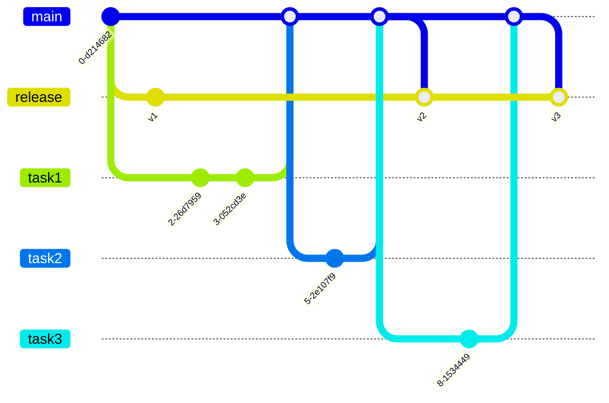

```mermaid
gitGraph
commit

branch release
commit id: "v1"

checkout main
branch task1
checkout task1
commit
commit

checkout main
merge task1

branch task2
checkout task2
commit

checkout main
merge task2

checkout release
merge main id: "v2"

checkout main
branch task3
checkout task3
commit

checkout main
merge task3

checkout release
merge main id: "v3"
```
